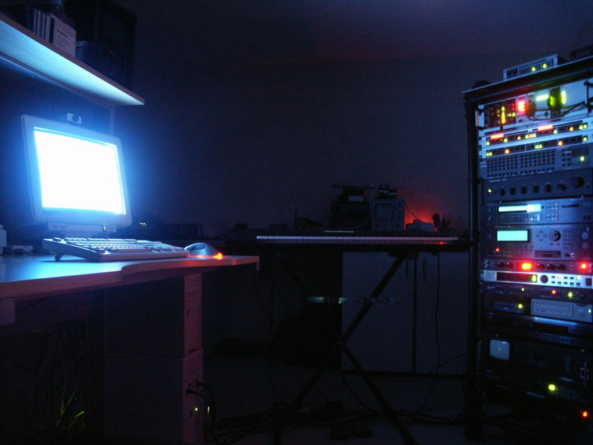
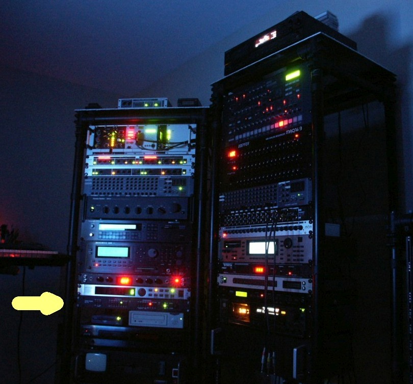
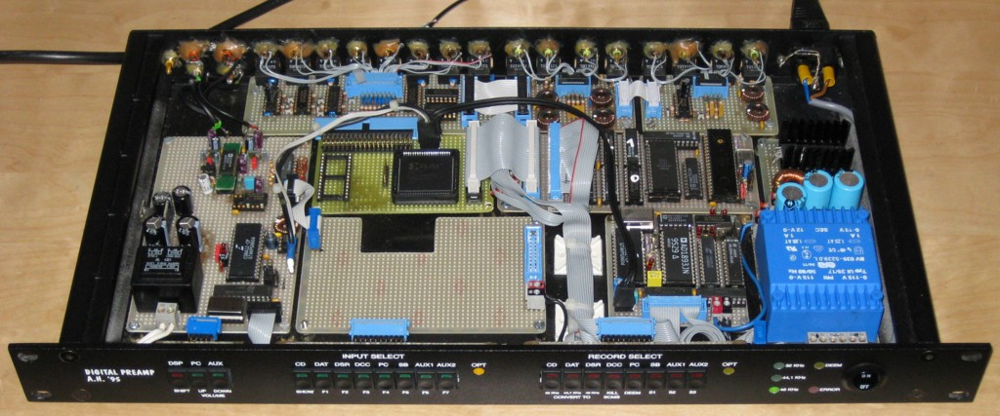
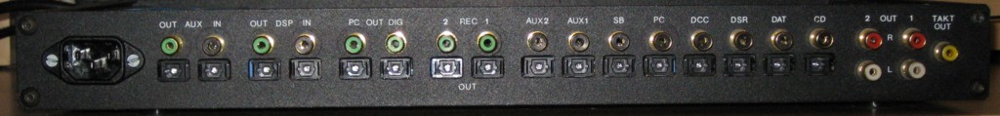
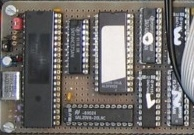
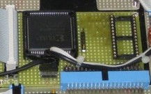
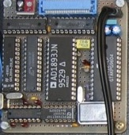
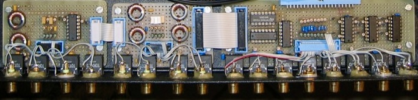
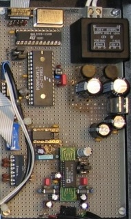

# The RTAL Digital Audio Patchbay in its original working environment
Developed as the digital backbone of a complete studio system.

<p align="center">
  


  
*Figure 1 – The RTAL Digital Audio Patchbay in its original working environment*
</p>

# RTAL-CDAD-001

# Digital Audio Patchbay

### Engineering Archive

---

## The RealTimeAudioLab Collection

### Collection II · Classic Digital Audio Designs (1985–2020)

**Engineering Audio Systems since 1980**

> *Preserving Engineering. Inspiring Future Designs.*

---

<p align="center">



*Figure 1 – Digital Audio Patchbay Frontview*
</p>



*Figure 2 – Digital Audio Patchbay Backview*
</p>

# About this Repository

This repository preserves the complete engineering archive of the **Digital Audio Patchbay**, a professional digital audio routing system developed during 1995.

Unlike most open-source repositories, this project documents not only the software but the complete engineering process, including original hardware, firmware, programmable logic, historical design documents and prototype photographs.

The objective is to preserve this engineering work for future developers, students and audio enthusiasts.

---

# Project Passport

| Item                | Description                    |
| ------------------- | ------------------------------ |
| Project ID          | RTAL-CDAD-001                  |
| Collection          | Classic Digital Audio Designs  |
| Development Period  | 1995                           |
| Open Source Edition | 2026                           |
| Status              | Engineering Archive            |
| Hardware            | Original Prototype             |
| Firmware            | Intel 8051 Assembly            |
| Programmable Logic  | CPLD + GAL                     |
| Documentation       | Original Engineering Documents |
| License             | GNU GPL v3                     |

---

# Why was this project developed?

During the 1990s, digital audio systems became increasingly complex.

CD players, DAT recorders, MiniDisc systems, computers and digital musical instruments all provided optical and coaxial S/PDIF interfaces.

However, there was no central device that combined flexible digital routing, DSP integration, sample rate conversion and S/PDIF bitstream manipulation.

The Digital Audio Patchbay was therefore developed as a complete engineering solution for an entire digital music system.

Its objectives included:

* Central routing of all digital audio connections
* Support for optical and coaxial S/PDIF
* Flexible DSP insert loops
* Integrated Sample Rate Converter
* One-button SRC activation
* SCMS control
* De-Emphasis control

“I wanted a central routing system that allowed every optical and coaxial digital input and output of my complete music system to be controlled according to my own requirements.”

The Digital Audio Patchbay has been an integral part of the author's setup since 1995.
To the author's knowledge, no comparable product combining these functions was commercially available at that time.

---

# Why is this repository unique?

This repository includes:

* Complete Intel 8051 Assembly firmware
* Original CPLD source code
* Original GAL source code
* Original hand-drawn engineering schematics
* Prototype photographs
* Original German user manual
* Engineering documentation
* Historical design information

Rather than recreating the original work with modern tools, the original engineering documents have intentionally been preserved.

---

# Gallery

### Digital Audio Patchbay


---

### Internal Construction


---

### CPU Controller Board



---

### CPLD Board



---

### Format-Converter Board



---

### Input- Output- Interface Board for S/P-DIF and KOAX



---

### DAC Board



---

# Original Engineering Documents

One of the most valuable parts of this repository is the collection of original hand-drawn engineering schematics.

Unlike modern CAD-generated schematics, the original circuit diagrams are preserved in their hand-drawn form.
These drawings document the actual engineering process and therefore remain part of the historical documentation.

They document the actual engineering process and therefore form an important part of the historical archive.

Included are:

* CPU Controller Board
* Audio Matrix
* Format Converter
* Digital Routing Logic

•	One central digital audio router for the complete music system.
•	Support for optical and coaxial S/PDIF.
•	Flexible routing of all digital inputs and outputs.
•	Independent monitoring and recording paths.
•	Integrated sample rate converter.
•	Sample rate converter selectable by a single key press.
•	Multiple external DSP insert loops.
•	Direct manipulation of selected S/PDIF channel status bits.
•	SCMS modification.
•	De-Emphasis modification.
•	High operational simplicity.
•	Reliable real-time operation.

---

# Hardware

The system consists of several dedicated hardware modules:

* CPU Controller Board
* Digital Audio Matrix
* Sample Rate Converter
* S/PDIF Receiver / Transmitter
* Analog Output Stage
* Front Panel Controller
* Power Supply

---

# Firmware

The complete firmware has been written entirely in **Intel 8051 Assembly Language**.

No C compiler has been used.

Every hardware function, timing requirement and peripheral interface was implemented manually without the use of a C compiler.

Today, complete embedded systems of this complexity written entirely in assembly language have become increasingly rare, making this repository an interesting historical reference for embedded software engineering.

---

# Programmable Logic

The repository also contains the complete programmable logic.

Included are:

* CPLD source code
* GAL source code

These devices implement essential parts of the digital routing architecture.

---

# Repository Structure

```text
docs/

engineering_archive/

images/

hardware/

firmware/

```

---

# Engineering Philosophy

This project was not developed as a commercial product.

It was developed to solve a practical engineering problem within a complete digital music environment.

The repository therefore documents not only the finished system but also the engineering decisions behind its development.

---

# Historical Preservation

This repository intentionally preserves

* original firmware

* original schematics

* original documentation

* original photographs

rather than replacing them with modern equivalents.

The goal is to preserve the engineering history of the project.

---

# License

GNU General Public License Version 3

---

# About RealTimeAudioLab

RealTimeAudioLab documents complete engineering developments in

* Audio Engineering
* Digital Audio
* Embedded Systems
* Digital Signal Processing
* Open Hardware

The collection preserves engineering work developed since 1980 and makes it available for education, research and future engineering projects.

---

*"Every circuit tells a story. Every design preserves a moment in engineering history."*
